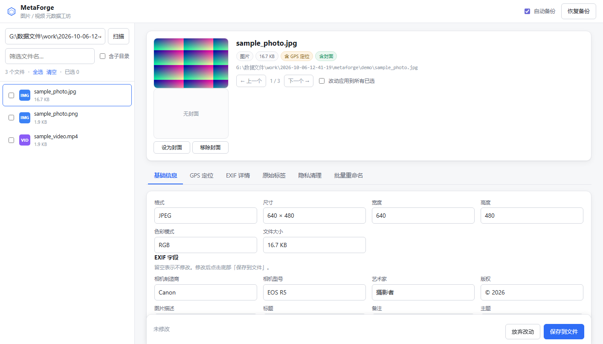

# MetaForge · 图片视频元数据工坊

一个本地运行的图片 / 视频元数据（Metadata）查看与修改工具。
**纯离线**——不联网、不上传，服务只监听 127.0.0.1。



---

## 它能做什么

| 能力 | 图片 | 视频 |
|------|------|------|
| 基础信息（标题/作者/描述/版权/日期） | EXIF + XMP | ilst 标签（`©nam` `©ART` `©alb` `©cmt` `©day` `cprt`…） |
| GPS 定位 | GPS IFD（含南纬西经负值） | `©xyz` + QuickTime `loci` |
| 厂商私有标签 | 保留 MakerNote | 保留 Android `Keys` box 与未知 uuid |
| 隐私清除 | 三档强度 | 三档强度 |
| 封面修改 | 内嵌预览图（EXIF IFD1） | `covr` 封面图 |
| 批量重命名 | 模板变量，支持 25+ 变量 | 同左 |

支持格式：
- 图片 `JPEG` `PNG` `WebP` `TIFF`（`HEIC/AVIF` 可读，写入需另配 exiftool）
- 视频 `MP4` `MOV` `M4V` `M4A` `3GP`

---

## 快速开始

```bash
pip install -r requirements.txt
python run.py
```

浏览器会自动打开。左侧填文件夹路径 → 扫描 → 点文件即可编辑。

其他参数：

```bash
python run.py --port 8899          # 指定端口
python run.py --no-browser         # 不自动开浏览器
python run.py --folder "D:\照片"    # 启动时预填目录
```

### 打包成 exe

```bash
pip install pyinstaller
python build.py
# 产物: dist\MetaForge\MetaForge.exe，双击即用，无需装 Python
```

---

## 界面说明

六个页签，各司其职：

- **基础信息** —— 文件属性 + 可编辑字段。视频页列出所有 ilst 标签（可直接改值）；图片页列出可写的 EXIF 字段。
- **GPS 定位** —— 支持 `31.2304, 121.4737` 或 ISO-6709 `+31.2304+121.4737/` 两种写法，自动识别南纬/西经并写入正确的参考位。带地图跳转。
- **EXIF 详情** —— 只读，完整列出文件里实际存在的每一个 EXIF 字段，含 GPS 原始值与厂商 Keys。
- **原始标签** —— 排查未知标签用，含 XMP 原文。
- **隐私清理** —— 三档强度，见下。
- **批量重命名** —— 模板化命名，预览后才执行，自带冲突检测。

### 三档隐私清理

| 档位 | 移除内容 | 适用 |
|------|----------|------|
| **仅去定位** | 只清 GPS | 想保留拍摄信息，只是不想暴露位置 |
| **标准清理** | GPS + 设备型号 + 序列号 + 软件 + 作者 + 版权 | 发朋友圈 / 社交平台前 |
| **完全归零** | 除尺寸分辨率外全部抹除 | 对外发布 / 存档 |

写入前默认开启**自动备份**（生成 `.mforge.bak`），顶栏「恢复备份」可一键回滚。

### 重命名模板

```
{创建日期}_{序号2}_{相机}          →  2026-10-06_01_EOS-R5
{年}{月}{日}_{时}{分}{秒}_{文件名}   →  20261006_143052_IMG_1234
{制造商}_{镜头}_{序号3}            →  Canon_RF24-70_001
```

可用变量（点界面上的标签可插入）：文件名、扩展名、序号、序号2、序号3、创建日期、拍摄日期、创建时间、年、月、日、时、分、秒、相机、制造商、镜头、作者、标题、描述、版权、经度、纬度、海拔、宽度、高度。

---

## 技术实现

### 无外部依赖的元数据读写

不依赖 exiftool / ffmpeg，纯 Python 实现：

```
core/
  atoms.py       ISO BMFF box 树解析与重建（含 largesize / uuid / FullBox 变体）
  quicktime.py   MP4/MOV ilst 标签、covr 封面、©xyz+loci GPS、XMP 写入
  images.py      EXIF(piexif) + XMP(JPEG APP1 / PNG iTXt) + IPTC 剥离
  privacy.py     三档清理策略与 EXIF 标签白名单
  renamer.py     模板渲染、冲突检测、两阶段安全重命名
  server.py      本地 HTTP API（标准库，无框架）
  unified.py     按类型分派 + 备份 + 缩略图
web/             单页界面（原生 JS，无构建步骤）
```

### 四个容易踩的坑（已处理）

**1. `moov` 变大导致视频损坏**

往 MP4 写元数据会让 `moov` 膨胀。`stco`/`co64` 里的 chunk offset 是绝对文件偏移，只有位于 moov 之后的顶层 box 位置会平移——faststart（moov 在前）需要整体 +delta，而 moov 在文件尾时 mdat 根本不动，一刀切加 delta 会直接把视频改坏。`quicktime.write_ilst` 现按「旧布局 → 新布局」逐段计算位置差，chunk offset 落在哪个顶层段就加哪段的差。测试覆盖两种布局的变长写入与 30KB 超大字段。

**2. 标签名编码**

ilst 的 atom 名是单字节 latin-1，`©` 是 `0xA9`。用 UTF-8 解码会变成替换字符 `�`，导致标签既读不出也写不进。代码中 `_u()` 处理标签名、`_ut()` 处理文本值，不可混用。

**3. moov 在文件尾部的大视频读不到**

手机录像（非 faststart）的 moov 在文件尾，「头尾各读一段再拼接解析」会让拼接边界上的 mdat 被撑成吞掉 moov 的巨 box，元数据全部读不到（写入成功但回读为空，表现为"改了没保存"）。现在用流式 box 头索引定位 moov 后按需读取，任意大小/布局都能解析；封面提取同理。

**4. iPhone/安卓视频的 mdta Keys 体系**

这类文件的元数据不在 `©nam` 式标签里，而是 `uuid`(A2394F52…) Keys box 存名字表、ilst 里以 4 字节序号为 item 类型存值。现在正确解析 Keys 表并把序号项映射为 `com.apple.quicktime.*` 可读字段，GPS 从 `location.ISO6709` 读取；隐私清理同步支持清除 Keys 设备痕迹。另注意：只读字段（封面占位文本等）不能参与写入，否则会用占位文本覆盖二进制封面。

### 参考项目

- [exiftool](https://exiftool.org/) / [ExifToolGui](https://github.com/FrankBijnen/ExifToolGui) —— 标签体系与 GUI 交互范式
- [XuanRanDev/exif-editor](https://github.com/XuanRanDev/exif-editor) —— 视频元数据多字段联动的思路
- [piexif](https://github.com/Harinair/ piexif) —— EXIF 读写与 GPS 坐标转换
- ISO/IEC 14496-12（box 结构）、14496-14（stco/co64）

---

## 测试

```bash
python tests/make_assets.py     # 生成测试媒体（含结构完整的最小 MP4）
python tests/test_engine.py     # 引擎层 45 项
python tests/test_server.py     # 服务层 37 项（真实 HTTP 请求）
python tests/repro_video_bugs.py          # 视频专项回归 25 项（大文件/Keys/stco/loci）
python tests/e2e_video_check.py           # 服务层视频端到端 9 项
python tests/ui_flow.py 8971    # UI 全流程 15 项（需先启动服务，CDP 驱动真实浏览器）
python tests/ui_shot.py 8971 demo   # 生成界面截图 → docs/
```

测试覆盖：往返一致性、像素零损失、stco 偏移对齐（faststart 与 moov-at-end 两种布局）、负值坐标、厂商标签保留、mdta Keys 映射与清理、三档清理、冲突重命名、目录穿越防护，以及「界面上改值 → 点保存 → 落盘回读确认」的真实端到端链路。

UI 测试依赖 `websocket-client`，且需本机已装 Chrome 或 Edge（脚本直接用系统浏览器，不下载 Chromium）。

---

## 注意事项

- 写入前请开启备份。元数据清理不可撤销。
- MP4 写入采用「整体重写」策略，大文件（数 GB）会占用同等内存；超大视频建议先拆分或改用 exiftool 命令行（它支持流式处理）。
- `HEIC` / `AVIF` / `ProRAW` 的写入未实现——piexif 不支持这些容器，需要 exiftool 配合。
- AVI / WebM 为 RIFF 容器，目前只能读容器概要。

## License

MIT
